# 串String

[toc]

## 定义

* 串的位序是从1开始的

* Position of substring:子串==首次==出现在主串中的位置

* 与线性表的区别：

  1. 以==子串==为进行增删改查的操作(Substring)
  2. 串的数据对象限定为字符集

* 串的比较操作：

  1. 从第一个字符开始依次对比，先出现更大的字符的串的就更大

     （ascii）

  2. 长串的前缀与短串相同，长串更大

​        默认每一个字符占一个字节 1B（8bit）

+ 基本操作：index(定位操作)、compare（比较操作）

**Null string**（空串） is a substring of any string,

any string is a substring of itself.

Constants & Variables of string 串变量&串常量

+ space string 空格串/ blank string
+ Equal： Two strings have the same value.

## 存储结构

串： 一种特殊的线性表

```
 Fixed length sequential storage：定长顺序存储表示 ，将串定义成
字符数组，利用串名可以直接访问串值。用这种表示方式，串的存储空间
在编译时确定，其大小不能改变。
 Heap allocated storage：堆分配存储方式，仍然用一组地址连续的存
储单元来依次存储串中的字符序列，但串的存储空间是在程序运行时根据
串的实际长度动态分配的。
 Linked block storage: 块链存储方式：是一种链式存储结构表示。
```

### &顺序存储（数组--静态/动态）

优点：随机存取，方便查找

缺点：不方便收缩


没有长度限制，并且字符位序和数组的下标相同

### &链式存储（结点）


为了提高串的==存储密度==，每个结点存多个字符，没有字符的位置用“#”或“\0”补全

## 代码实现基本操作

### 线性（静态数组）

#### 求子串


==从第pos个字符开始，由于包含自个，所以要往前面进一个==

#### 比较


当遇到不同的值，就做减法

#### 定位


###### ==i<= n-m+1== 如果超过了，则无法匹配；

##  Pattern Matching Algorithm of String 串的模式匹配算法

模式匹配成功是指在主串S中

能够找到模式串T，否则，称模式串T在主串S中不存在。

#### BF（Brute-Force）穷举/暴力算法

依次匹配

匹配失败回溯

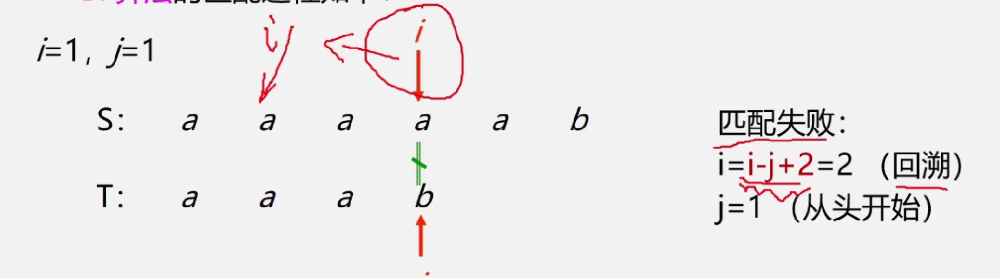

==i-j+1 +1==

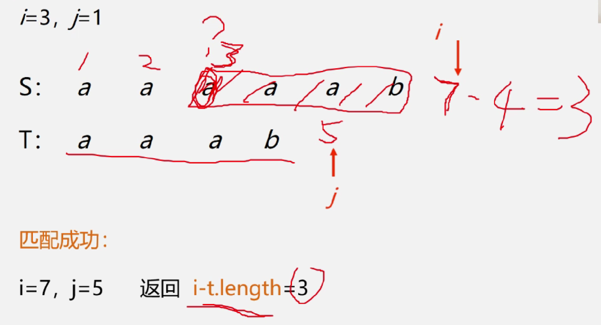

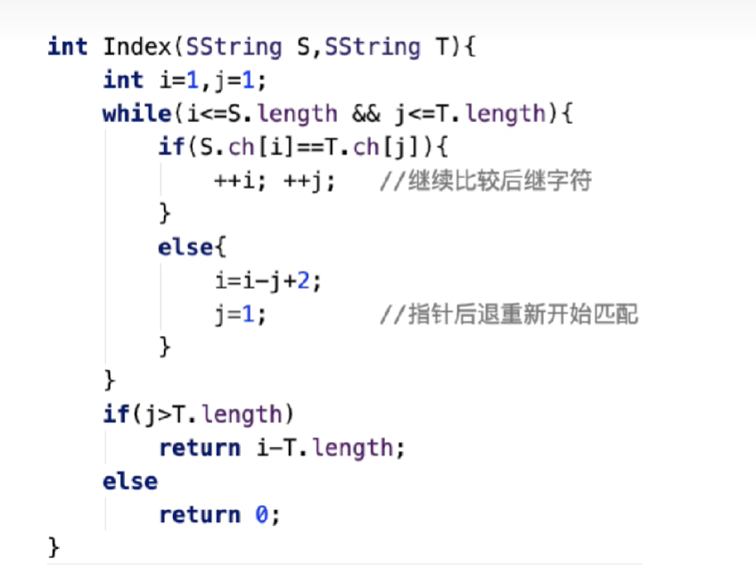

最后j应该严格等于

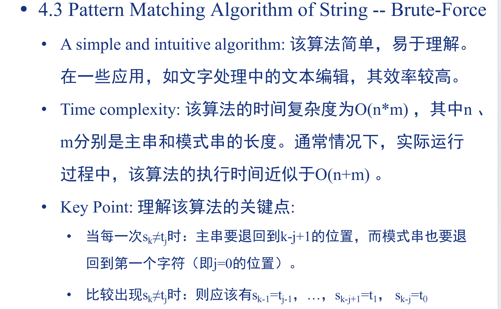

#### KMP（时间效率高）

不回溯--加快滑动速度

(理解版)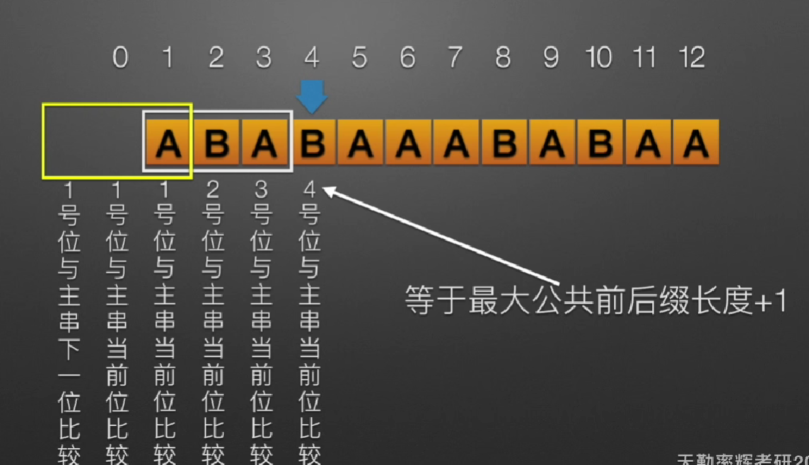


 **<u>比较字符的第几位</u>**与**<u>当前主串中对应字符</u>**进行比较

next函数

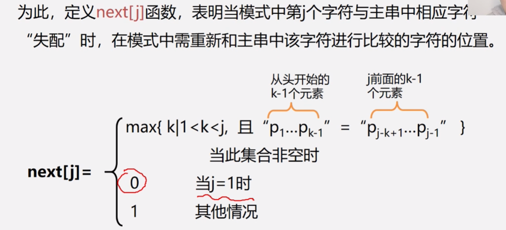 

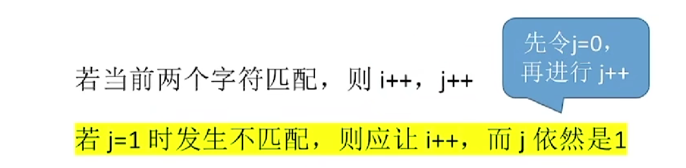

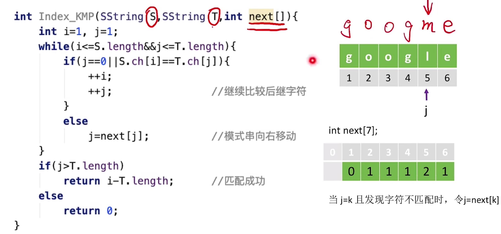

==如果是第一个字符发生了不匹配，则上下都应该向右滑动，所以将next[1]=0,这样可以借助后续滑动代码，完成初匹配的滑动==

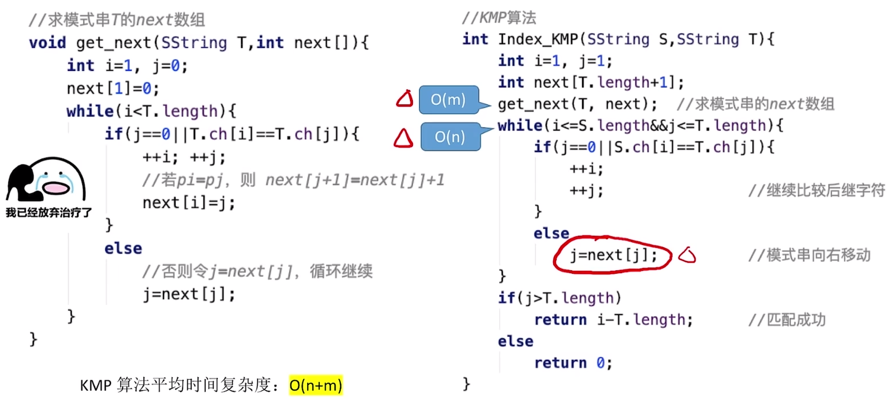

  背！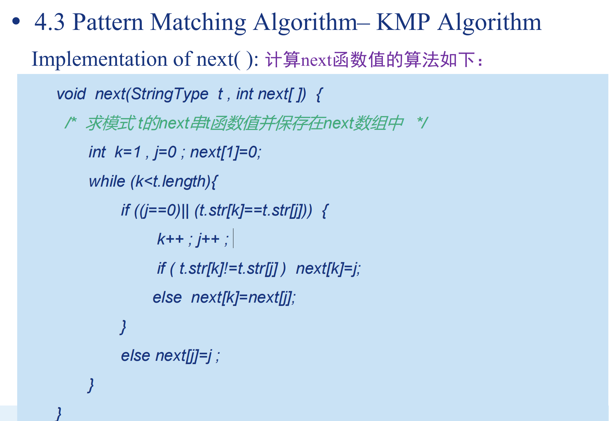

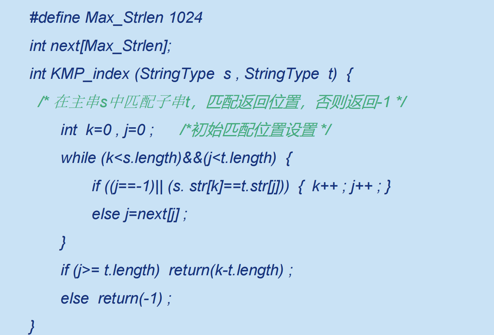
