# 图Graph

[toc]

## 图的定义 

### 1. 顶点、边、阶

在图中，数据元素被称为 <u>顶点</u>，和在树中将数据元素称为节点是有区别的，用 **v（Vertex）**表示。<u>不同的顶点之间的连线称为 边</u>，用 **E（Edge）**表示。

图（Graph）是由<u>顶点的 有穷非空 集合</u>和顶点之间的连线（边）的集合组成。通常表示为 G=(V, E)，其中 G 表示一个图，V(G) 代表图 G 中的顶点集合，E(G) 代表图 G 中的边集合。

用 |V| 表示图 G 中顶点个数，也称为图 G 的<u>阶</u>。

用 |E| 表示图 G 中边的条数。 

==线性表可以是空表，树可以是空树，但是图不能是空，v一定是非空集，一定有顶点==

==但是可以没有边，==

==图的边两头一定有顶点==

### 2. 无向图、有向图

###     简单图、多重图

###     完全图

在无向图中，如果任意两个顶点之间都存在边，则称该图为 **无向完全图**。

含有 n 个顶点的无向完全图有 n ( n − 1 ) / 2 条边。

在有向图中，如果任意两个顶点之间都存在方向相反的两条弧，则称该图为 **有向完全图**。

含有 n 个顶点的有向完全图有 n ( n − 1 )条边 。

Sparse Graph**:** **有很少边或弧的图（如***e<n㏒n）的图称为稀疏图，反之称为 

Dense Graph(稠密图)

### 3.顶点的度

+ 

在==无向图==中，**顶点 v 的度**（Degree）是和 v 相关联的边的数目，记为 TD(v)。

因为一条边可以给与这条边相连接的两个顶点分别提供 1 度，所以，**无向图中所有顶点的度之和就应该是边数 \* 2**，即 `2|E|`。

+ 

有向图中，因为一条边可以给与这条边相连接的两个顶点分别提供 1 出度和 1 入度，所以 **有向图所有顶点的入度之和与出度之和相等并且等于弧的数量。**

### 4. 顶点之间的关系

<u>路径是顶点序列</u>

路径上<u>边</u>或有向边（弧）的<u>数目</u>称为该<u>路径的长度</u>

有路径存在就是连通的，不一定需要直接连接

连通图

让剩下的点全部直接连接起来

强连通图

### 5.子图

首先子图要是图

生成子图：包含了原图的所有顶点，但是去掉了原图的几个边

### 6.连通分量

连通分量：极大连通子图--连通不再可扩展

（“极大”：对子图再添加图G中其他顶点，子图就不再连通）

###     强连通分量

### 7.生成树、生成森林

（注意：有n-1条边的图不一定是生成树）

树：连通图

有向树：不是强连通图

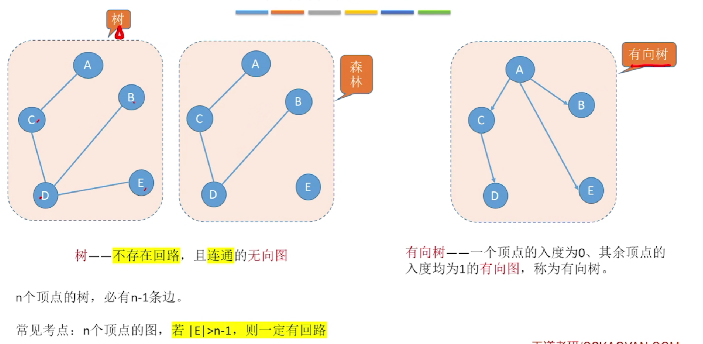

### 8.边的权、带权图（网）

### <u>9.总结</u>

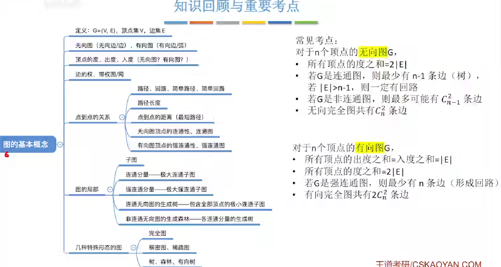

## 图的存储

### 1. *邻接矩阵表示法（数组表示法）

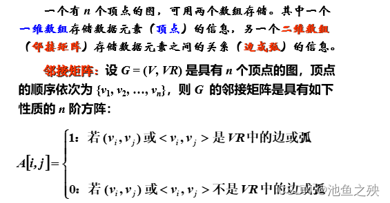

有向图的度=入度+出度

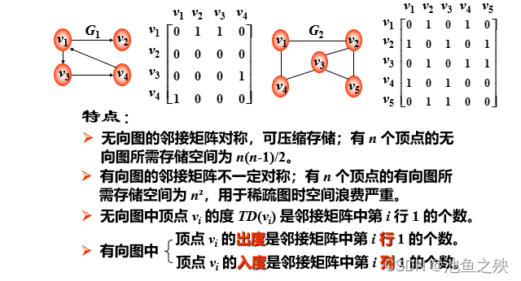

无向图的边数：上 (或下)三角形矩阵中非0元素的个数 （是个数，不是值！)

有向图的弧的数目：邻接矩阵中非0元素的个数

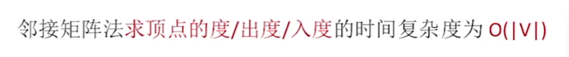

带权图

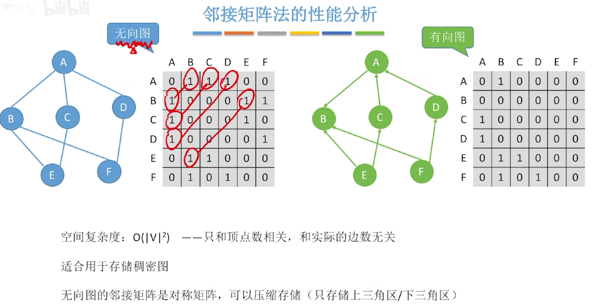

性能分析

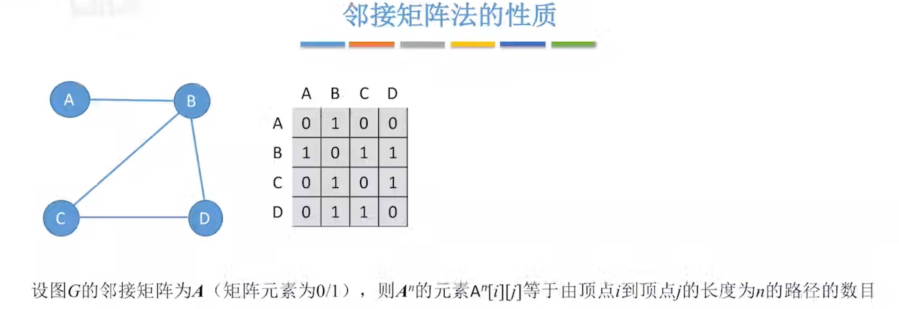

### 2.*邻接表（类似于树的孩子链表表示法）

顺序+链式

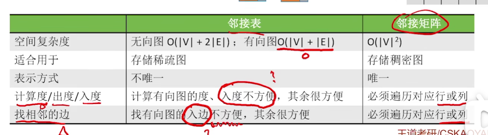

对于无向图，邻接链表是唯一的

对于有向图，邻接链表有两种形式，正·邻接链表：方便找出度；逆·邻接链表：方便找入度

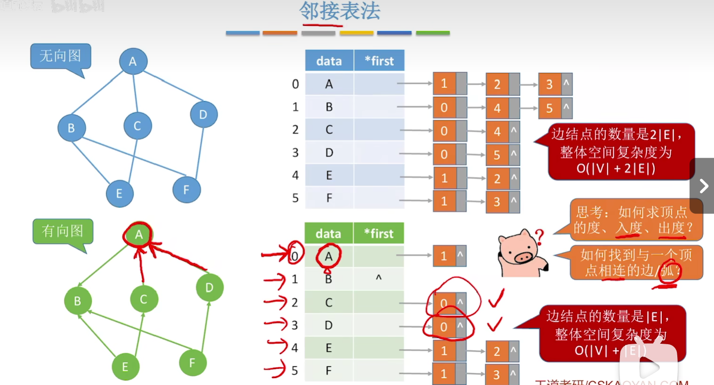

### 3.十字链表（有向图）

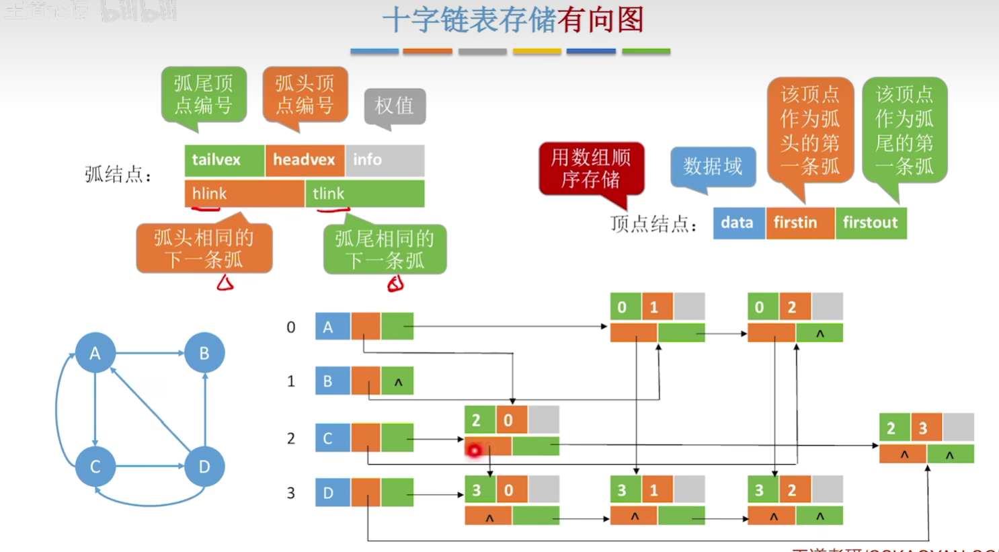

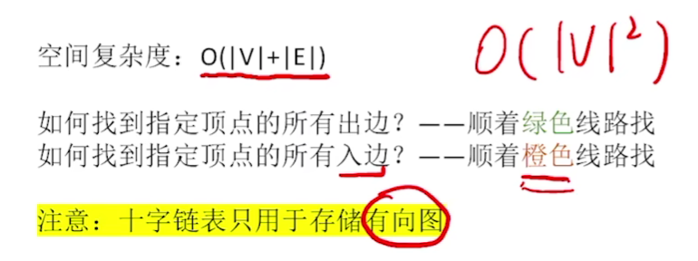

### 4.邻接多重表（无向表）

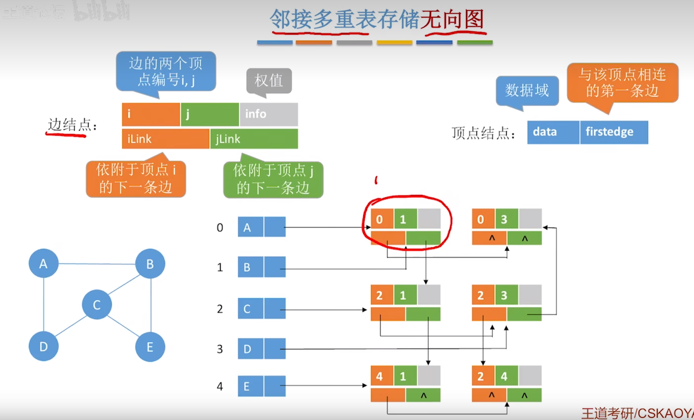

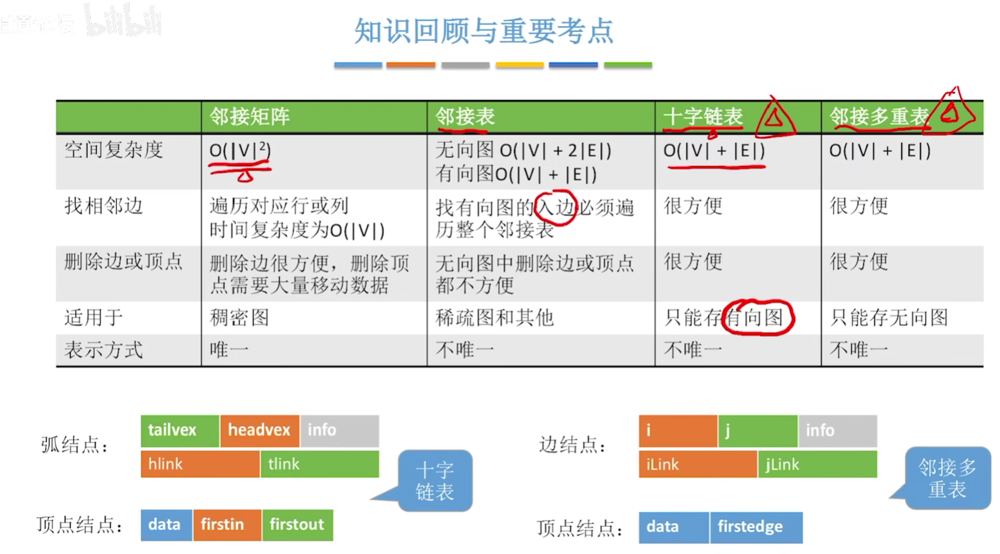

## 图的基本操作

## 图的遍历

**对于空间复杂度：**

BFS：辅助队列（层序遍历）

DFS：递归工作栈（先根遍历）

**对于时间复杂度：**

都是一样的，<u>访问结点的时间+访问所有边的时间</u>

邻接矩阵：O（v^2）

邻接表：O（|V|+|E|）

（唯一区别是邻接点搜索次序不同）

### 广度优先遍历（BFS）

#### 树的广度优先遍历（层序遍历）

广度--横向

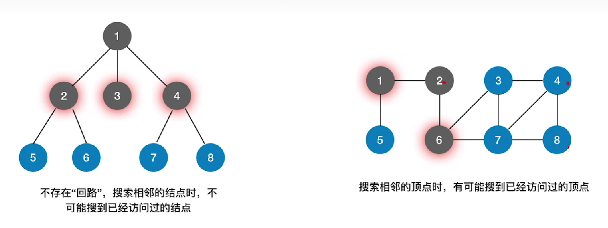

标记数组：标记哪些结点被访问过

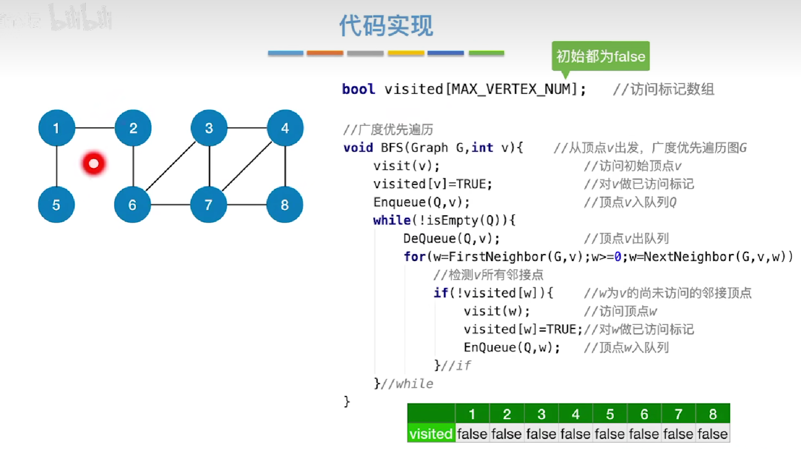

如果<u>存储结构不同，遍历顺序</u>可能不同：

邻接矩阵--递增排列--表示方法唯一，遍历序列唯一

邻接表--序列是可变的，不唯一的

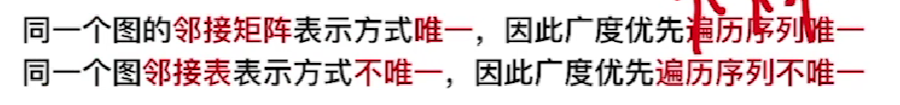

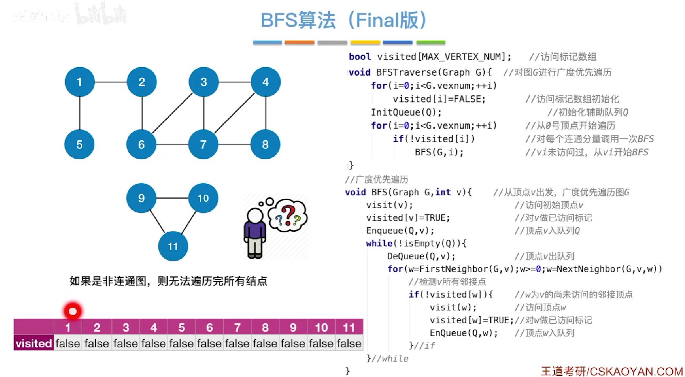

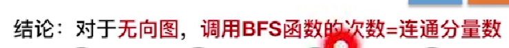 

连通分量：极大连通子图

+ 空间复杂度：

  

  

+ 时间复杂度

  

  （==计算时间复杂度的时候，没有进入代码中，凡是遇到对于广度优先算法和深度优先算法的时间复杂度计算，不要进入代码，简化为逻辑==）

  ###### （==<u>时间开销：访问顶点+访问边</u>==）

#### 广度优先生成树

根据广度优先遍历的过程，将图改造成树

基于邻接矩阵--树唯一

基于邻接表（表示方式不唯一）--广度优先生成树也不唯一     

### 深度优先遍历（DFS）

#### 树的深度优先遍历（先根/后根）

#### 图的深度优先遍历--先根

+ 空间复杂度

  

+ 时间复杂度

  

往后退

### 图的遍历与图的连通性

注意有向图的路径--可到达--注意方向

4  5

## 图的应用

### 1. 最小生成树

生成树

最小生成树（最小代价树）

MST（Minimum-Spanning-Tree）

结合权值

边的带权一样

*连通图--树*

*非连通图--森林*

### Prim算法

 

注意是纳入<u>树</u>里面，树会长大，所以连上树上面的哪一个结点都是正确的

### Kruskal算法

 

## 最短路径问题

BFS

Dijkstra算法

不适合带有负权值的带权图

Floyd算法

