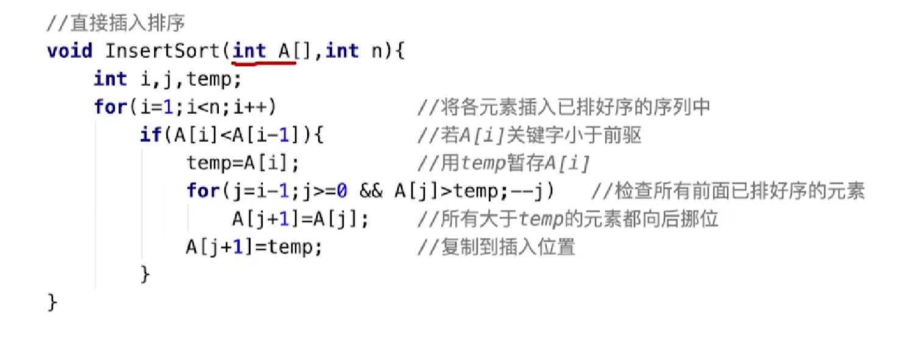
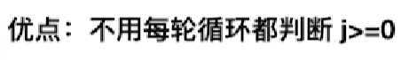
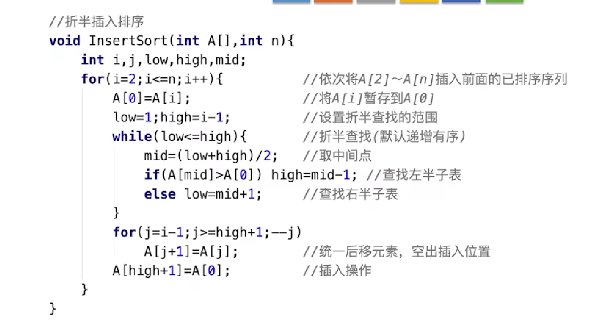
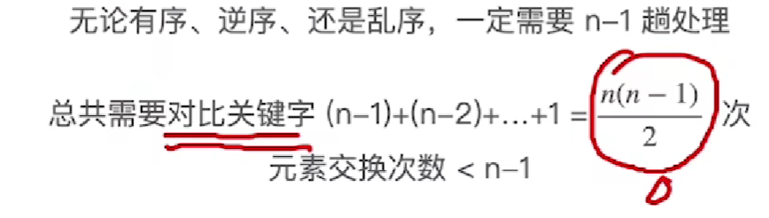

# 排序Sorting

## 排序的概念

1. 定义：将各元素按关键字递增/递减顺序重新排列

2. 评价标准：

   1. 时间复杂度、空间复杂度
   2. ###### ==稳定性：关键字相同的元素经过排序后相对顺序是否会改变==

3. 排序的分类：

   1. 内部排序：待排序的记录数不太多，所有的记录都能存放在内存中进行排序；

      ~~~基本操作：
   基本操作；
        1.Compare：比较两个关键字的大小（必不可少）
   
        2.Move Element：存储位置的移动，记录从一个位置移动到另一个位置（顺序需要，链式只需要修改结点的指针，不需要移动记录
   
        顺序--记录数较少的情况；链式--记录数较多的情况【有时还会引入辅助表】）
   
   2. 外部排序：待排序的记录数太多，所有的记录不可能存放在内存中，排序过程中必须在内、外存之间进行数据交换；

## *#插入排序*

**算法思想：**每次将一个待排序的记录按其关键字大小插入到前面已排好序的子序列中，直到全部记录插入完毕；

#### 直接插入排序

适用于顺序表（随机存储，比如说从中间随便查找出一个数）、链表

将待插入排序的关键字保存在temp变量中（防止被挪位的元素直接取代）+前面所有更大的元素都向后挪位

//哨兵：

哨兵优点：

1. Swap space：不需要增加辅助空间存放待插入的元素
2. Boundary safety：哨兵监视，不用每一次在内循环中判断j是否越界，保证查找插入位置的内循环总可以在超出循环边界之前找到一个等于当前记录的记录（如果递增序列：最小的话，会与哨兵比较，没有小于，即不符合循环条件，就会退出循环，此时j==0，j+1=1，所以就是插入在了第一个位置上）

算法分析：

最坏情况：原本为逆序

平均时间复杂度==（**最好**时间复杂度+**最坏**时间复杂度）/2

//优化：

由于插入的元素之前都是有序的，所以可以减少时间复杂度，选取**折半查找**的方法--

#### **折半插入排序**

==仅适用于顺序表==   （链表做不到直接找到中间的元素==随机查找）

<u>从时间上比较，折半插入排序仅仅减少了关键字的比较次数，却没有减少记录的移动数，所以时间复杂度还是O（n^2）</u>

**Low的位置**

不用移动，直接存放就好 

==注意else的部分，满足稳定性保证==

## 希尔排序

又称“缩小增量法”，<u>基于插入排序的优化</u>

思路：直接插入排序的最好情况：原本就有序

​                                         较好情况：基本有序

思想：先追求表中元素部分有序，再逐渐逼近全局有序

对<u>子表</u>2进行<u>直接插入排序</u>，会修改顺序

<u>缩小增量d，重复操作</u>

<u>直到d==1为止</u> （整个表已经呈现出“基本有序”，对整体再进行一次“直接插入排序”）

（考试中通常会给出增量）

i++：轮流切换子表操作 不考虑代码！

==不稳定==

==仅适用于顺序表（d-随机访问特性）==

## 快速排序

 （“交换”排序：根据序列的两个关键字的比较结果来对换这两个记录在序列中的位置）

### *#冒泡排序*

<u>算法可以提前结束</u>--排序的一趟未发生任何交换

<u>每一次排序都可以使一个元素移动到其最终位置</u>

如果两个关键字相等，不要交换其位置，保证稳定性 == ==稳定的==

如果遍历一趟，没有发生任何交换，则代表排序已经完成了

区分：交换次数==调用swap函数的次数

​            移动次数==每一次交换都会移动元素3次

适用于链表：和相邻元素比较和交换

### <u>快速排序</u>

==不稳定==

每一趟会使中间元素确定其最终位置

小的放一边，大的放一边

不断划分

递归操作

pivot 枢轴、基准==选取low指针指向的元素关键字

先从high走，因为一开始low是空指针

注意递归跳出条件

平均是接近最优的：

//好的情况：

​    若每次选中的“枢轴“能够将待排序序列划分为均匀的两个部分，则递归深度最小，算法的效率最高

//坏的情况：

​    n个元素，分为了n层的二叉树

思考： “一次划分” & “一趟排序”

## 选择排序 

每一趟在待排序元素中选取关键字最小的元素加入有序子序列

### 简单选择排序

适用于顺序表 & 链表

直接在每一趟找到最小元素，和它该处与的位置的元素换位置，将它放在最终位置上

最后剩下的元素不用处理，肯定是最大的那个元素：n个元素 需要进行n-1趟处理

算法性能分析 

==不稳定==

### <u>堆排序</u>

Heap

==不稳定==

建堆：

所有非叶子结点进行调整，按要求比较孩子的关键字，并用根节点与孩子结点交换，向上回溯；

注意有时需要不断下坠！！！

排序：

<u>堆顶结点</u>与堆底结点互换位置--<u>不再管他</u>（脱离堆），换上去的顶不断下坠

## *#<u>归并排序</u>*

Merge：归并：把两个或多个==已经有序==的序列合并成一个

算法思路：

定义多个指针，其中一个指针指向合并序列，剩余指针指向待合并序列，每次对比待合并序列所指元素大小，选择更小的一个放入合并序列中；

~~~
“2路”归并--每选出一个小元素需对比关键字1次
“4路”归并--每选出一个小元素需对比关键字3次
~~~

应用：

使用归并排序完成<u>**内部排序**</u>（“2路”排序）

2路归并的“归并树”--形态上就是一棵倒立的二叉树

h层==h-1趟排序

==稳定的==

## *#基数排序*

Radix Sort

又称桶排序，数字排序：按待排序记录的关键字的组成部分（或“位”）进行排序

与上面不同，不需要进行关键字的比较与记录的移动，利用多关键字排序是思想实现单逻辑关键字的排序。

权重递增

空间复杂度==O（n+r）

n个指针域空间，r个辅助队列

==稳定的==

##### *斜体#：稳定的*

##### <u>下划线</u>：算法性能优秀，时间复杂度为nlog2n

