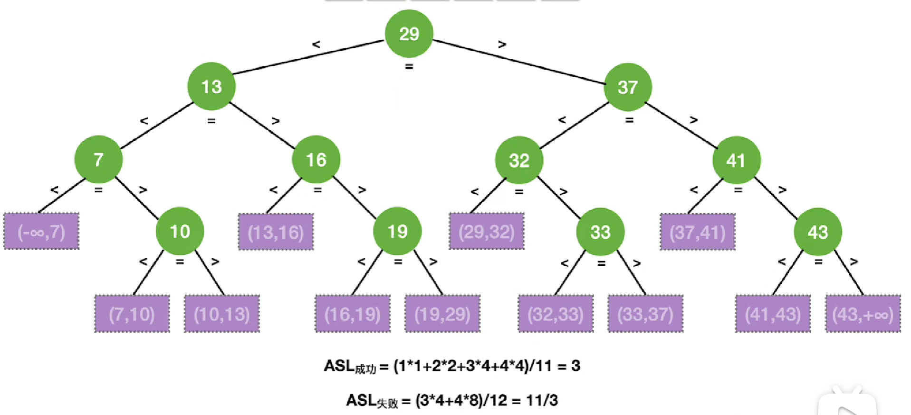
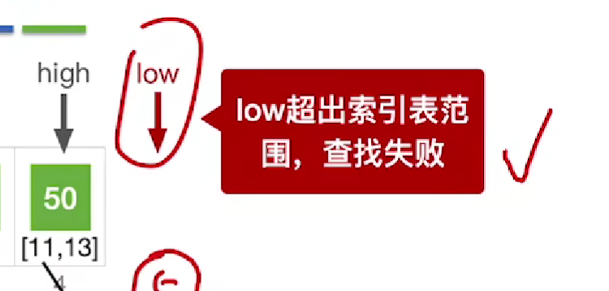
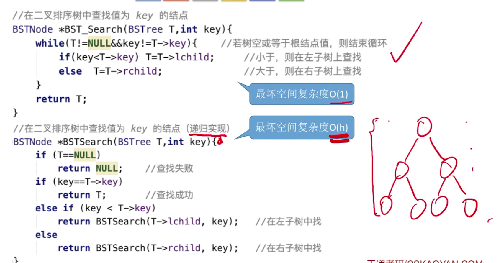
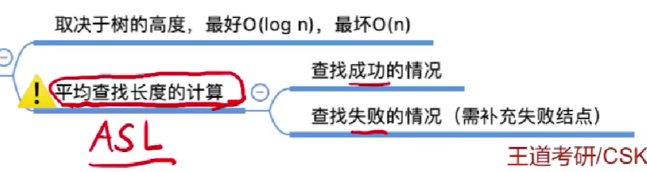
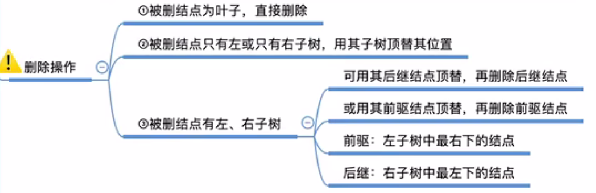

# 查找Search

## 1.基本概念


关键字：<u>唯一</u>标识

==查找表，不是一个新的数据结构，对于查找的数据结构的统 称==

~~~
查找表： search table
关键字：key
查找/检索：searching
~~~


## 2.静态查找*4


### 2.1顺序查找   == o（n）==

2.1.1算法思想：顺序查找，又称“线性查找”，通常用于线性表。

###### 有序或无序

（顺序存储、链式存储）

2.1.2实现：

哨兵实现方式：


2.1.3查找效率分析：

###### 顺序查找的优化（对有序表）


用==查找判定树==分析ASL

**优点：查找失败时ASL更少**

###### 顺序查找的优化（被查概率不相等）

****

**优点：****查找成功时ASL更少**，但是对于查找失败的情况没有改善，所以看实际情况，如果失败的可能性更大，就用第一种优化方法


### 2.2 折半查找

2.2.1  折半查找，又称“二分查找”，

###### 仅适用于==**有序**==的**==顺序表==**->数组

向下取整


```
以逆序为例子：

1. 相等==查找成功
2. 大于==待查记录在区间的前半段，修上界指针，High=Mid-1
3. 小于==待查记录在区间的后半段，修下界指针，Low=Mid+1
```

直到越界，Low>High

2.2.2 实现：

基于升序排列


2.2.3 查找效率分析



###### 折半查找判定树


==只有可能右子树的结点比左子树多，但最多多一个结点==


###### 数量级直接反映折半查找的**时间复杂度**log2N

###### 失败结点：n+1个（等于成功结点的空链域数量）


##### 拓展思考


### 2.3 分块查找（手算）

2.3.1算法思想


###### 块内无序：顺序查找 最大关键字

块间有序：索引表：顺序/折半

 折半查索引：



查找效率分析

###### ASL：平均查找长度 根号n+1

先查找外面的块+再查找里面的元素


最小值：导数=0

（了解）

### 2.4 斐波那契查找**Fibonacci**

根据斐波那契数列的特点对查找表进行分割

ASL与分块查找是一样的

左边是K--，右边是K=K-2


low>high:查找失败

+ 填充数据，数据扩充成等于一个相近并且更大的、满足斐波拉且数列的顺序表，方便切割，但是low和high是不会改变的，如果low和high的值越界到了填充难过的区域，则也是查找失败的！

## 3.动态查找*3

###  3.1 二叉排序树（BST）

排序：sort

3.1.1定义

Binary Search Tree

二叉排序树，又称 二叉查找树

###### ==左子树结点<根结点<右子树结点==

###### ==默认不允许两个结点的关键字相同==

递归的，树满足，子树也满足：


3.1.2 查找

 




3.1.3 插入

第一种方法，会递归，直到出现空树（空子树），然后再直接将空树定义成结点


第二种方法，先定义一个新结点，把结点初始化，定义了结点的值，定义了结点的左右指针，都指向nullptr,然后再分情况将结点插入。


3.1.4 构造


3.1.5 删除


3.1.6查找效率分析

看树是平衡树，还是一般树



### 3.2平衡二叉树  AVL树 Log2n

Balanced Binary Tree

平衡二叉排序树Balanced Binary Sort Tree

：具有排序树的特性+每个结点都是平衡的

简称 平衡树AVL树

树上任一结点的左子树和右子树的高度之差不超过1

==结点的平衡因子====左子树高-右子树高 （只可能是-1、0、1）

只要有任一个结点的平衡因子绝对值大于1，就不是平衡二叉树


#### 3.2.1插入

~~~~
+ 插入新结点后，要保持二叉排序树的特性不变（左<中<右）
+ 若插入新结点导致不平衡，则需要调整平衡
~~~~


平衡二叉树的插入->调整（最小不平衡子树）->其他祖先结点都会恢复平衡

~~~
+ 以某些结点为根的子树的深度发生了变化
+ 某些结点的平衡因子发生了变化
+ 某些结点失去平衡
~~~


#### ==调整最小不平衡子树==


+ LL

  假定A为最小不平衡子树

  

  

  右旋

  

  

+ RR

  左旋

  

  ~~~
  右旋和左旋的大致代码思路：
    1.将B的孩子指针转移给A
    2.将空置的B的孩子指针指向A
    3.将A的父指针的孩子指针指向B
  ~~~

+ LR

  先左旋，再右旋

  左旋时，C替代B，此时C成为A的左孩子

  右旋时，再用C替代A，此时A成为C的右孩子

  （分析时，展开B的子树，用C标识新子树的根结点）

  

+ RL

  先右旋，替代B

  再左旋，替代A

  

###### ==只有左孩子，才能右上旋；只有右孩子，才能左上旋==


3.2.n查找效率

递推公式：一个根节点+一个左子树+一个右子树（符合条件的情况下，最小）

#### 3.2.2删除

~~~~
+ 删除结点后，要保持二叉排序树的特性不变（左<中<右）
+ 若删除结点导致并不平衡，则需要调整平衡
~~~~

1. 删除结点（方法同二叉排序树）



2. 向上遍历，找到最小不平衡子树，找不到最好，找到：

3. 找最小不平衡子树下，个头最高的儿子、孙子

   

4. 根据孙子的位置，调整平衡（LL/RR/LR/RL）

   

5. 如果<u>不平衡向上传导</u>，回到2--继续

   （由于树高变矮，不平衡性可能向上传导，出现其他不平衡子树）


#### 3.3哈希查找-散列查找 Hash Table

散列表，又称哈希表，是一种数据结构

特点是：数据元素的<u>关键字</u>与其储<u>存储地址</u>直接相关--通过散列函数（哈希函数）

哈希函数，是从关键字空间到存储地址空间的一种映像

均匀映射==减少冲突


##### 处理冲突问题的方法 1 --拉链法

把所有“同义词”存储在同一个链表中


###### ==不算指针的判定，因为没有对比关键字==


假设映射到每一个元素概率是一样的

###### **==装填因子==**


 

##### @  常见的散列函数（设计目标：减少冲突）

Tips：设计 要结合实际的关键字分布特点来考虑，不要教条化

Tips：用<u>空间换时间</u>的算法

1. **除留余数法**

   

   质数（1和他本身）：用质数取模，分布更均匀，冲突更少。

   （小于等于的最大质数）

2. **直接定址法**

   +地址集合和关键字集合大小相等，==完全不会产生冲突==，但实际中很少使用

   +适用于连续的关键字

   

   

3. **数字分析法**

   +适用于关键字位数>>哈希地址位数 & 可能出现的关键字事先知道

   

   

4. **平方取中法**

   +常用方法，适用于不知道全部关键字的情况

   +将关键字整体进行平方，所得到的结果和数的每一位都有关

   

   

   

   出生年月，平方取中，使得均匀

5. **折叠法**

   +将关键字分割成位数相同的几部分（最后一部分可以不同），取他们的叠加和作为哈希地址

   +适用于关键字位数很多 & 每一位上的数字分布大致均匀

   ~~~
   数位叠加：
      1.移位叠加：低位对齐
      2.间界叠加：沿分割界来回折叠，对齐相加
   ~~~

6. 随机数法：random函数

   +适用于关键字长度不等的情况

##### 处理冲突问题的方法 2 --开放定址法


==每次都是从第0次冲突开始的==

注意m是散列表的表长

增量d设计：

1. 线性探测法

   

   

   H0都是没有作用的！！！

   

   + 查找操作：

     和拉链法不同，同义词、非同义词都需要被检查，直到找到或者空缺，==空位置的判断也要算作一次比较==

     （拉链法的空位置算作空指针的比较，开放定址的空位置可以看作是同一个类型的元素）

   + 删除操作：

     ** **逻辑删除** **

     

   ~~~~
   优点：
     只要散列表未满，总能找到一个不冲突的散列地址；
   缺点：
     每个产生冲突的记录被散列到离冲突最近的空地址上，从而又增加了更多的冲突机会--“冲突的聚集”
   ~~~~

   

2. 平方探测法

   

   

   ~~~
   优点：
     探测序列跳跃式地散列到整个表中，不易产生冲突的“聚集”
   缺点：
     不能保证探测到散列表的所有地址
   ~~~

   

3. 伪随机序列法

##### 处理冲突问题的方法 3 --再散列法（再哈希法）

准备多个散列函数，一个发生了冲突就用下一个（同时利用不同的哈希函数构造散列表，计算哈希地址）

~~~
优点：
  不易产生冲突的“聚集”
缺点：
  计算时间增加
~~~

##### 处理冲突问题的方法4 --建立公共溢出区

冲突--则保存在溢出表里面。顺序存放，顺序查找。

##### 哈希查找分析

散列查找时的关键字与给定值比较的次数取决于：

1. 哈希函数
2. 处理冲突的方法
3. 哈希表的填满因子 α

