# 树与二叉树 Tree

[toc]

## 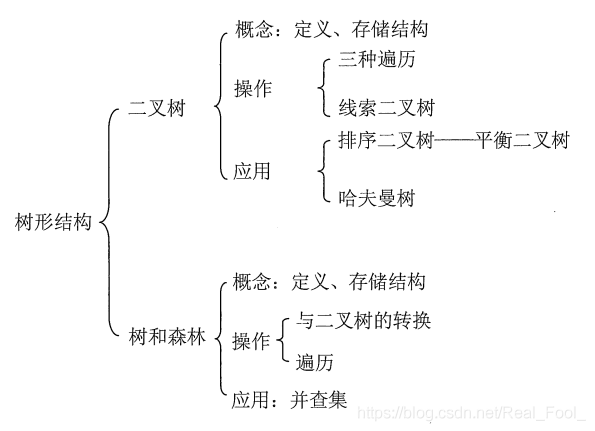

## 树概念及结构

### 1.1树概念

树Tree是一种**非线性**（nonlinear structure）

的数据结构，它是由n（n>=0）个有限结点组成一个<u>具有层次关系</u>的<u>有限集合</u>。 

（结点之间有分支）

(线性：1；1/非线性：树形 1：n

​                                        图形：m:n)

若n=0，称为空树；empty tree

若n>0,则满足如下两个条件：

1. [有且仅有]()一个特定的称为根（Root）的结点；

2. 其余结点可分为n（m>=0）个**互不相交**的有限集根的[子树]()（SubTree）

   &==树的定义是递归的，即在树的定义中又用到了自身，树是一种递归==
   
   ==的数据结构。==
   
   递归：Recursion

​			    & ==分层结构==，具有以下两个特点：

1. 树的<u>根结点</u>没有前驱，除根结点外的所有结点有且只有一个前驱predecessor。
2. 树中所有结点可以有零个或多个后继successor。

​                因此n个结点的树中有n-1条边。（除了根节点，头上都支出去一个）

overhanging / downwards Tree 倒悬树

### 1.2 树的基本术语

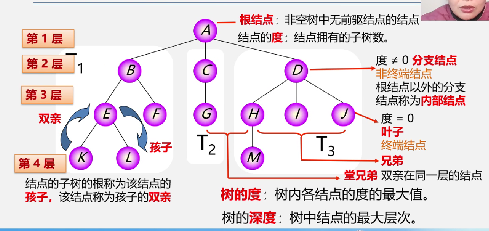

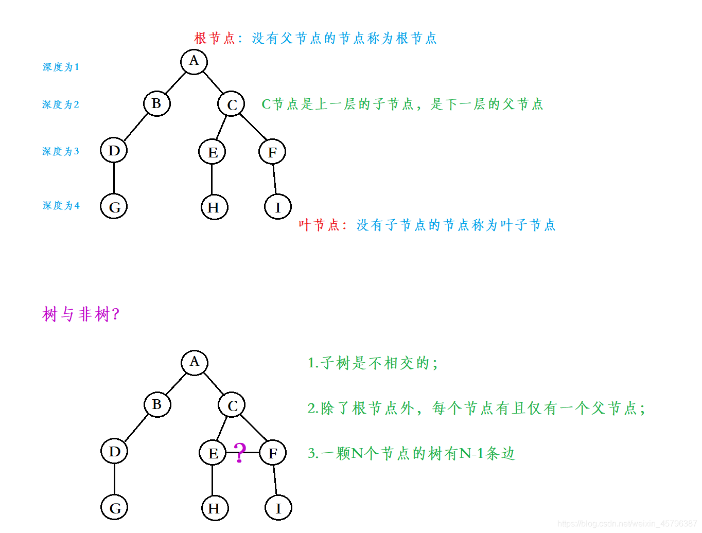结点：数据元素以及指向子树的分支

根节点：根节点没有前驱结点（非空树）

1. 结点的==度==degree：一个节点含有的<u>子树的个数</u>称为该节点的度； 如上图：A的度为2

2. 树的度degree：<u>一棵树中，最大的结点的度称为树的度</u>； 如上图：树的度为2

   

3. ==叶结点==leaf node ：度为0的结点称为叶结点； 如上图：G、H、I节点为叶节点

4. 非终端结点或分支结点branch nodes

   non-leaf node非叶节点：度不为0的节点； 如上图：B、D、C、E、F节点为分支节点

   ==（根结点之外的分支结点branch nodes称为<u>内部</u>结点）==internal nodes

   

5. **双亲**parent结点或父结点：若一个节点含有子节点，则这个节点称为其子节点

6. 父结点； 如上图：A是B的父节点

7. **孩子**child结点或子结点：一个节点含有的子树的根节点称为该节点的子节点； 如上图：B是A的孩子节点

   

8. **兄弟**Sibling结点：具有相同父节点的节点互称为兄弟节点； 如上图：B、C是兄弟节点

   同一双亲的所有子节点

   

9. 结点的**层次 **level：从根开始定义起，根为第1层，根的子节点为第2层，以此类推；

10. level path:层次路径：从根节点到达某节点p所经过的所有结点（唯一）

11. **树**的高度或**深度depth**：树中节点的最大层次； 如上图：树的高度为4

    

12. **堂兄弟cousin**结点：双亲在同一层的节点互为堂兄弟；如上图：H、I互为兄弟节点

13. 结点的**祖先**ancestor：从根到该节点所经分支上的所有节点；如上图：A是所有节点的祖先

    ````
    结点p的层次路径上的所有结点（除了p）
    意味着p在层次路径上！！！
    ````

    

14. **子孙descendant**：以某节点为根的子树中任一节点都称为该节点的子孙。如上图：所有节点都是A的子孙

15. 森林：由m棵互不相交的树的集合称为森林；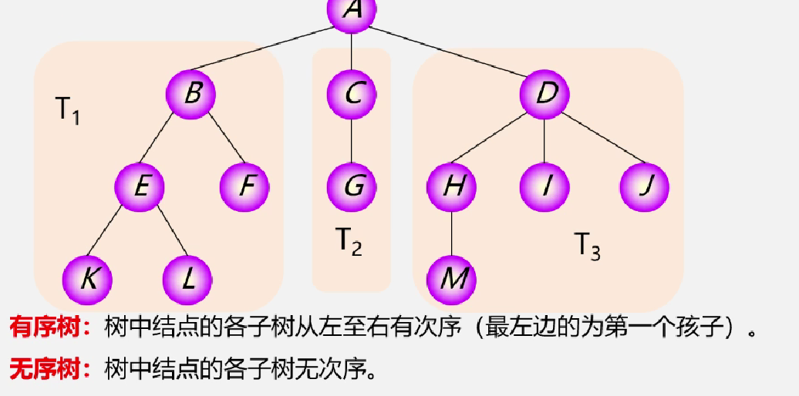

    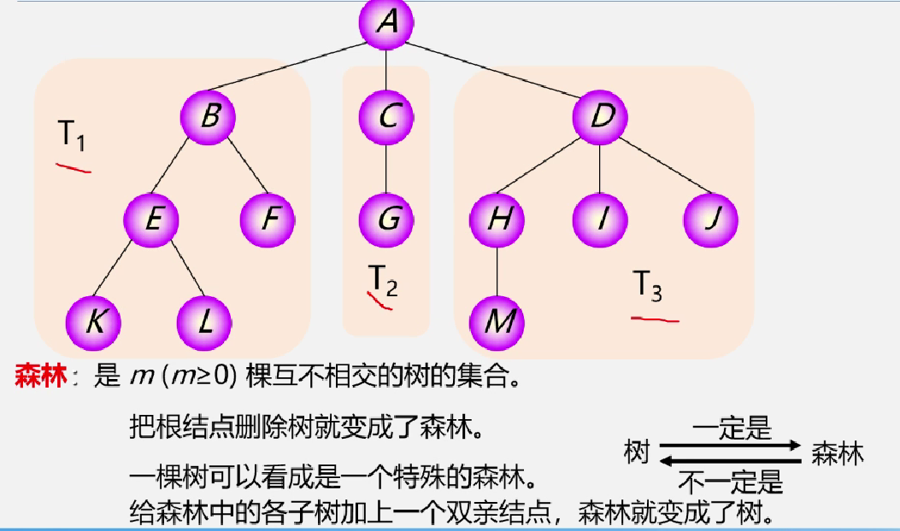

### 1.3 树结构与线性结构的比较

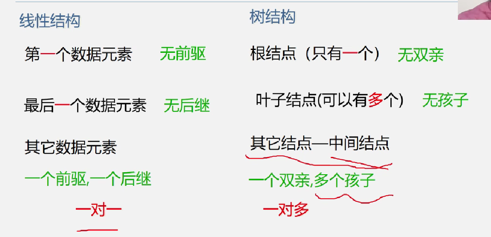

## 2.二叉树Binary Tree

### 2.1 概念

一棵二叉树是结点的一个有限集合，该集合或者为空，或者是由一个根节点加上两棵别称为左子树和右子树的二叉树组成。

&二叉树的特点：

~~~html
1. 每个结点最多有两棵子树，即二叉树不存在度大于2的结点。
2. 二叉树的子树有左右之分，其子树的次序不能颠倒。（有序树）
3. 根可以有空的左子树或空的右子树。

递归：二叉树的子树还是二叉树
~~~

==注意==：二叉树和树不一样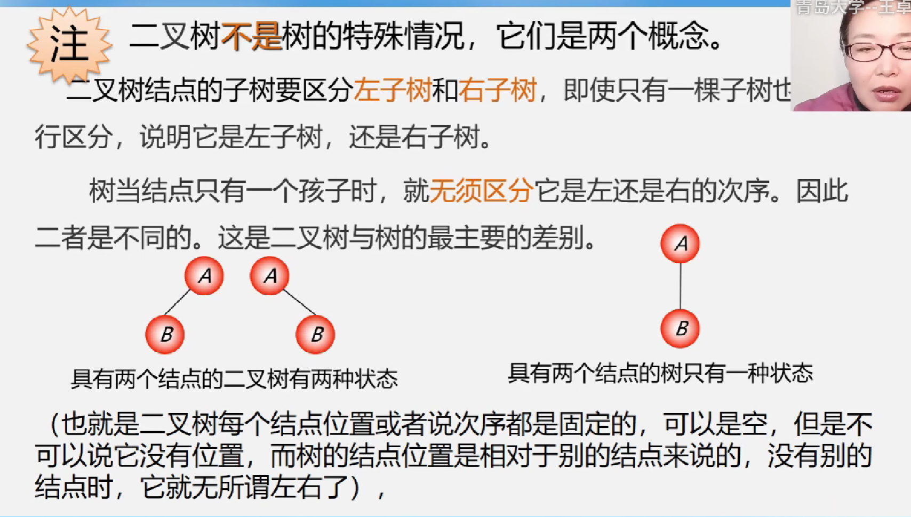

==二叉树结点位置固定，可以是空，但不能没有位置==


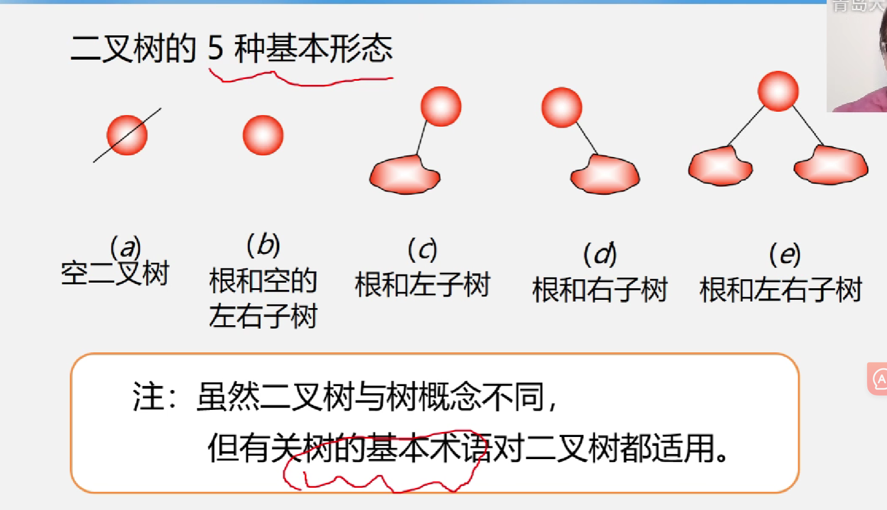

Full binary Tree

Complete Tree

###### ！！！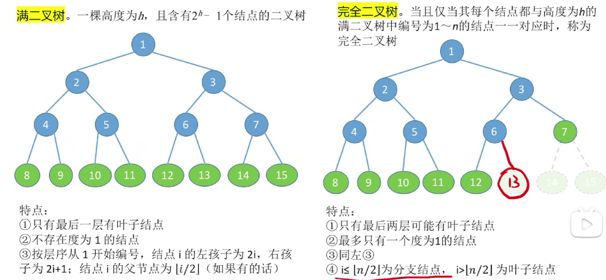

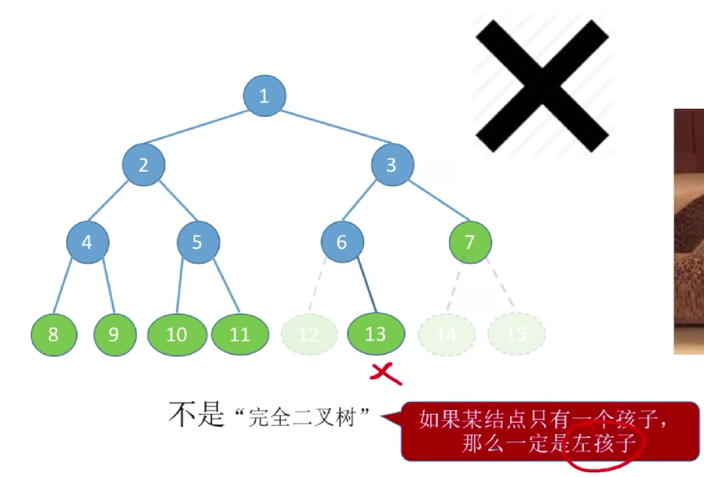

### 2.2常考性质properties

````
1.在非空二叉树中，第i层上至多有2^(i-1)个结点（i>=1）
2.在深度depth=k的二叉树至多含有2^k-1个结点（k>=1）
默认满二叉树，然后等比数列求和
3.对任何一棵二叉树，若其叶子结点数（度=0）为n0，度为2的结点数为n2，则
n0=n2+1(见考点1)
叶子结点比二分支结点多一个
（数的结点数=总度数+1【加上根节点】）
4.见常见考点1
5.见概念的！！！
````

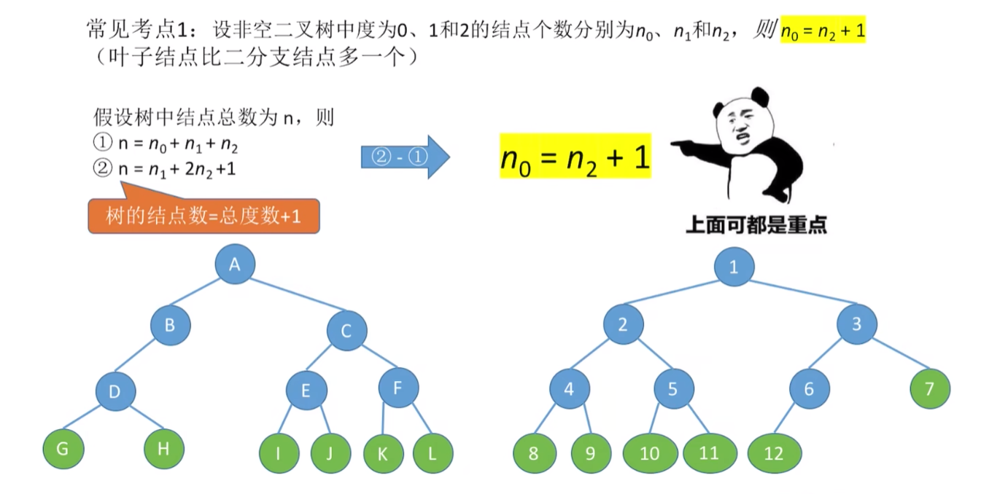

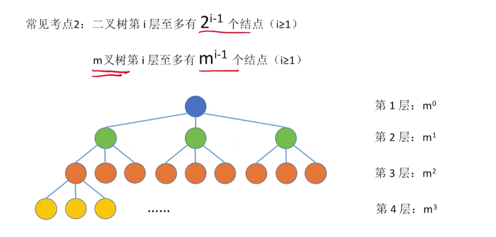

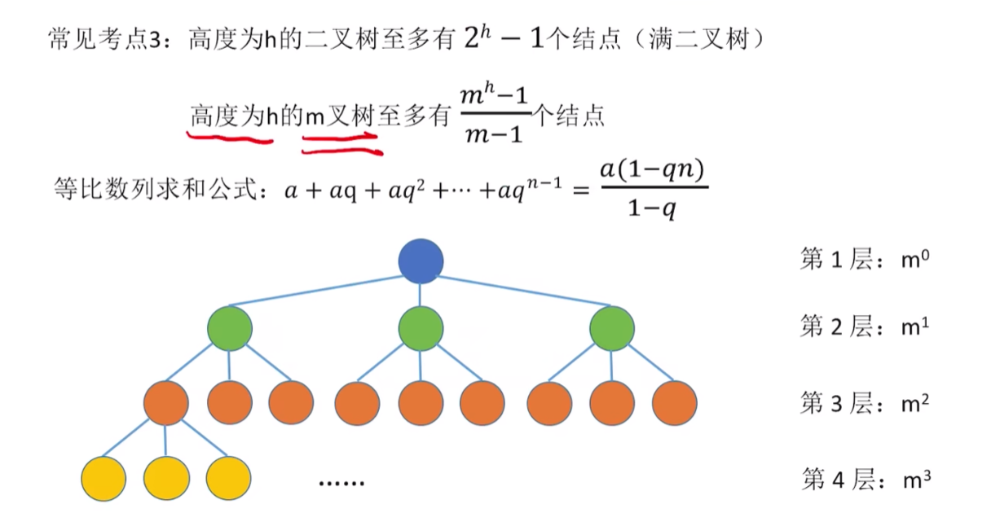

向上取整

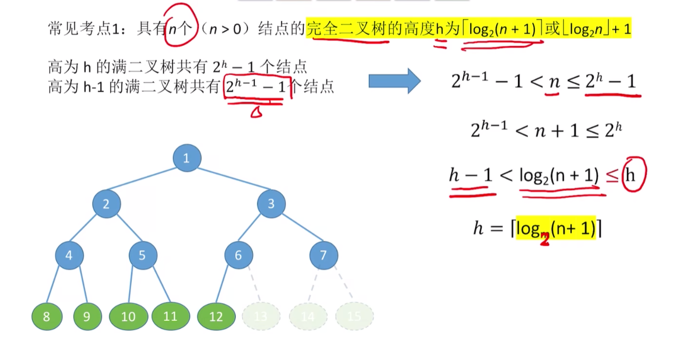

向下取整

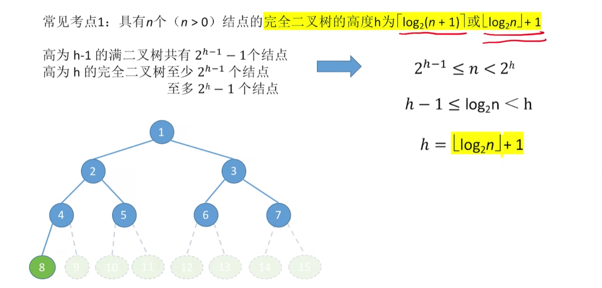

###### ！！！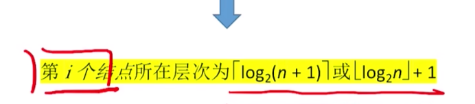

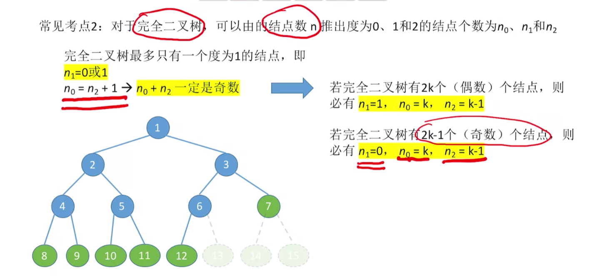

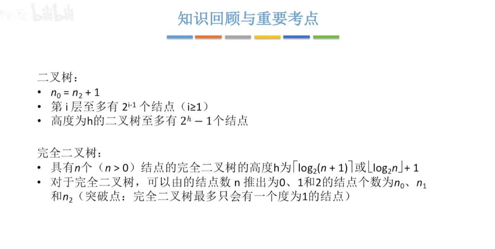

### 2.3 存储结构

+ ###### 顺序存储 Sequential Storage Structure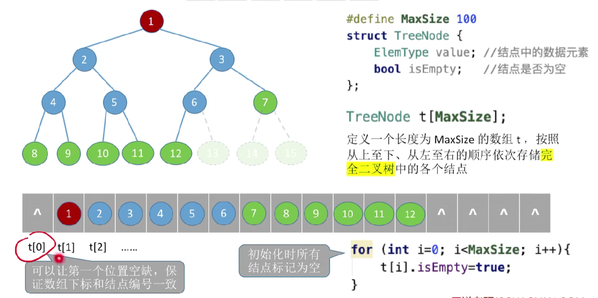

###### 1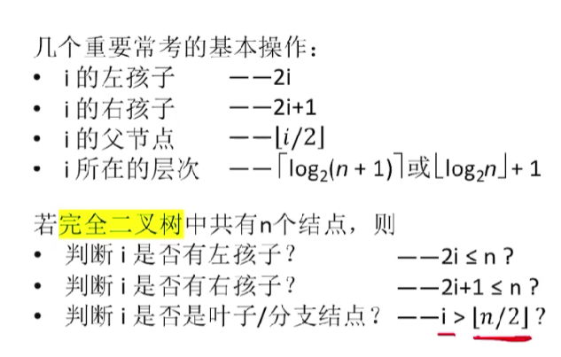

如果不是完全二叉树，无法按照结点编号反映出结点的逻辑关系；


可以通过结点找到对应的左孩子，右孩子，从而通过isempty的布偶值来判断该值是否存在：

 空间闲置


+ ###### 链式存储 Linked Storage Structure


没有孩子的话，可以设置为NULL；


一共有n个结点，每个结点两个指针，则一共有2n个指针域

除了根结点，每个结点的上方都有一个指针指向它，所以，n-1个指针是使用的，则有n+1个指针是空的（空链域）


### 2.4 二叉树的遍历Traversal


二叉树的递归特性

1. 空二叉树：什么都不用做
2. 二叉树，递归完成三种遍历


**代码遍历**


**（遍历左右子树时，采用递归的方法）**


画路径的方法是一样的，

先序：第一次路过

中序：第二次路过

后序：第三次路过


后序遍历算法的变换式


### 2.5 二叉树的层序遍历


### 2.6 由遍历序列推出二叉树结构


（==一定要有中序遍历==）

注意验证

前序可以知道==根节点位置==，中序对左右子树做划分


### 2.7 线索二叉树Threaded binary tree

#### 定义--flag field

#### （0是孩子，1是线索thread---precursor/successor）


当孩子指针不指向孩子，而指向前驱或者后继

空链域-->线索化：更方便找前驱和后继，并且遍历也更加的方便了


#### 二叉树的线索化

1.先找前驱后继


先序线索化：可能有转圈问题


#### 线索二叉树找前驱/后继

中序找后继

右子树的最左的孩子

中序找前驱

左子树的最右的孩子


先序找后继：

假设有左孩子，则是左孩子，没有左孩子就是右孩子，没有左右孩子，则是右孩子，指向后继结点

（先判断是否有右孩子，没有右孩子的话，线索化直接指向后继）

先序找前驱：（三叉链表）

先判断有没有左孩子--父节点


## 3.树的存储结构

### 3.1 树的逻辑结构

#### 双亲表示法（顺序存储）

每个结点中保存指向双亲的“指针”

结点的数组

指向双亲的指针--双亲的位置域


#### 孩子标识法（顺+链）

顺序存储各个结点，每个结点中保存孩子链表头指针


链表中只保存了所有的指针

#### 孩子兄弟表示法（链式）


### 3.2 森林和二叉树的转换


### 3.3 树、森林的遍历


#### 树的遍历

##### 深度优先遍历


##### 广度优先遍历

层序遍历:用队列实现


#### 森林的遍历


先序遍历森林==依次对各个树进行先根遍历

​                         ==对相应的二叉树（先进行转化）进行先序遍历

中序遍历森林 = =依次对各个树进行==后根遍历==

​                         ==对相应的二叉树（先进行转化）进行<u>中序遍历</u>

==孩子兄弟表示法==


## 4.哈夫曼树

```
一些基本概念：
Node Path：结点路径
Path Length:路径长度==边的树木
Path length of Tree:树的路径长度（从树根到每一个结点的路径长度之和）

Weighted Path Length of Node:结点的带权路径长度
从该结点到树的根节点之间的路径长度与结点权值的乘积
Weight:权值--各种开销、代价、频度等的抽象称呼
WPL of Tree:树的WPL，树中所有叶结点带权路径长度之和

Huffman Tree：最优二叉树（拥有最小的带权路径长度）
```


哈夫曼树不唯一，但是最小带权路径长度是唯一的

#### 哈夫曼编码（应用）


可用于：数据的压缩

Prefix Code:前缀编码

编码长短不等，且任意字符的编码都不是另一个字符编码的前缀

So，每一个字符都是叶子结点，不可能出现在根结点到其他字符结点的路径上，则不会出现前缀可能。
