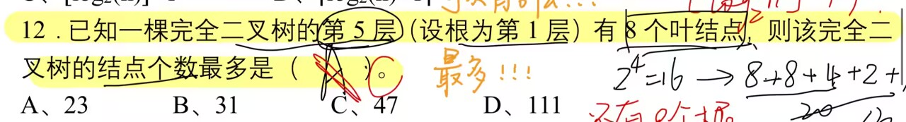

# 测试卷总结

1. 数据结构三要素：

   1. 逻辑结构：

      1. 线性结构：线性表--栈、队列、串  （一对一）
      2. 非线性结构：树、图、集合

   2. 存储结构（物理结构）：顺序存储&链式存储

      ~~~
      和存储结构有关的术语：
      “链表”--链式存储结构
      “循环队列”--顺序存储结构-一维数组
      “线索二叉树”--链式存储结构--线索（空余的指针域指向前驱或者后继）
      “哈希表”--也算--散列存储
      ##“有序表”--不算--中的“有序”是逻辑意义上的有序，指表中的元素按某种规则已经排好了位置，既可以用链式存储又可以用顺序存储，所以只是一种逻辑上的有序而不是实际存储的方式，是逻辑结构。
      ~~~

      

   3. 数据的运算

2. 树最适合用来存储 ： 元素之间具有分支层次关系的数据

3. 循环队列==顺序表（一维数组，逻辑上看作环状）

   队空：rear==front

   队满：（rear+1）%MAXSIZE==front 利用少一个元素空间的方法解决“假溢出”现象

4. 顺序存储结构，逻辑上相邻的元素物理地址上也是相邻的，满足随机访问的特性

   可以方便的访问第i个结点，也可以方便访问第i个结点的前驱结点==因为这相当于访问第i-1个结点（已知下标）

   而无论是插入还是删除，都涉及到元素的移动，时间复杂度不是O（1）

5. 

6. 入栈 push

   出栈 pop

7. 排序一律默认从小到大，升序排列

   冒泡排序：从前往后，俩俩比较，每一趟都能确定一个待排序最小元素的最终位置

8. Prim算法生成最小生成树：

   每一次的添加都是基于生成的新树，到树上任意结点的最小代价

   

   

   

   

   